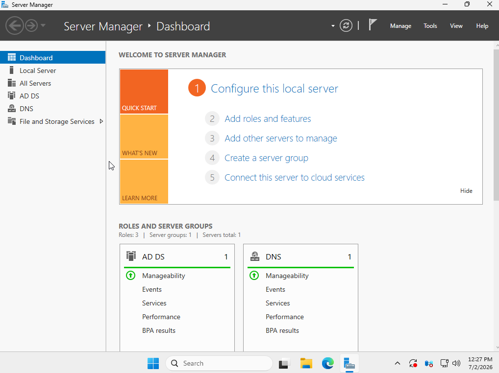
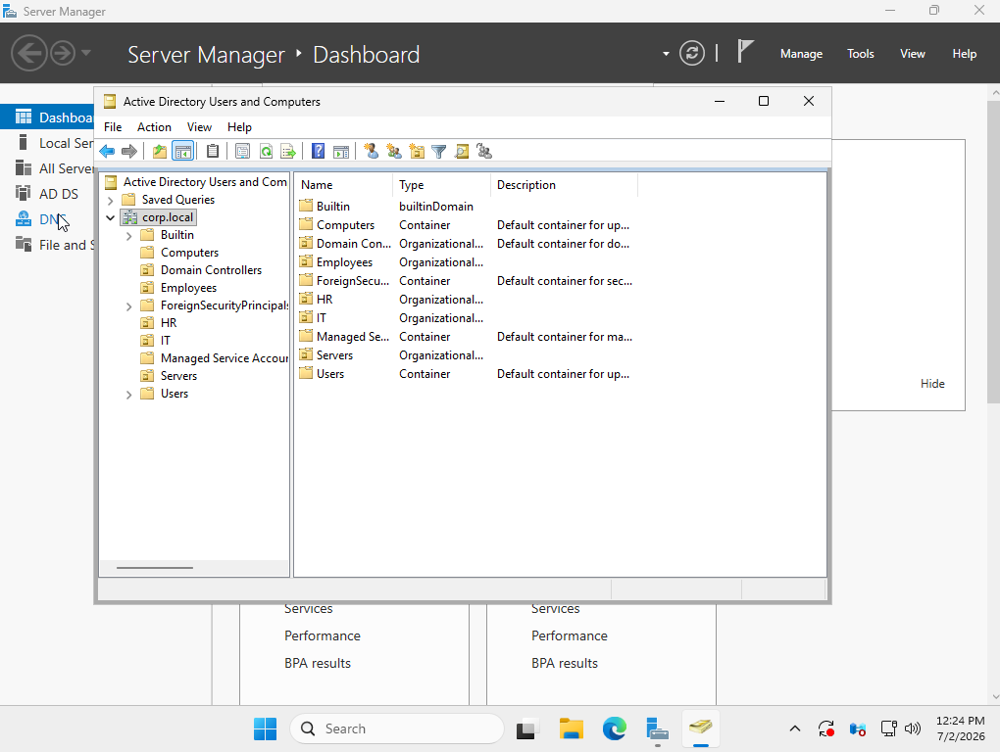
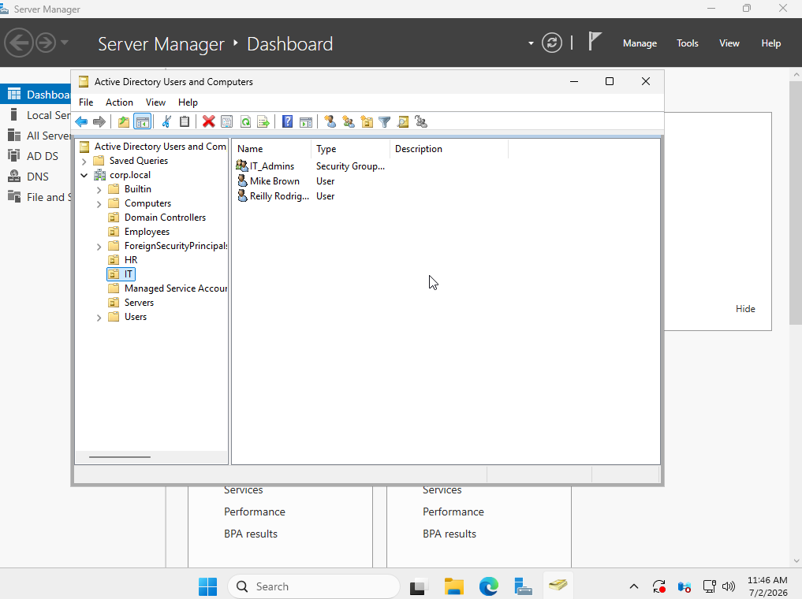
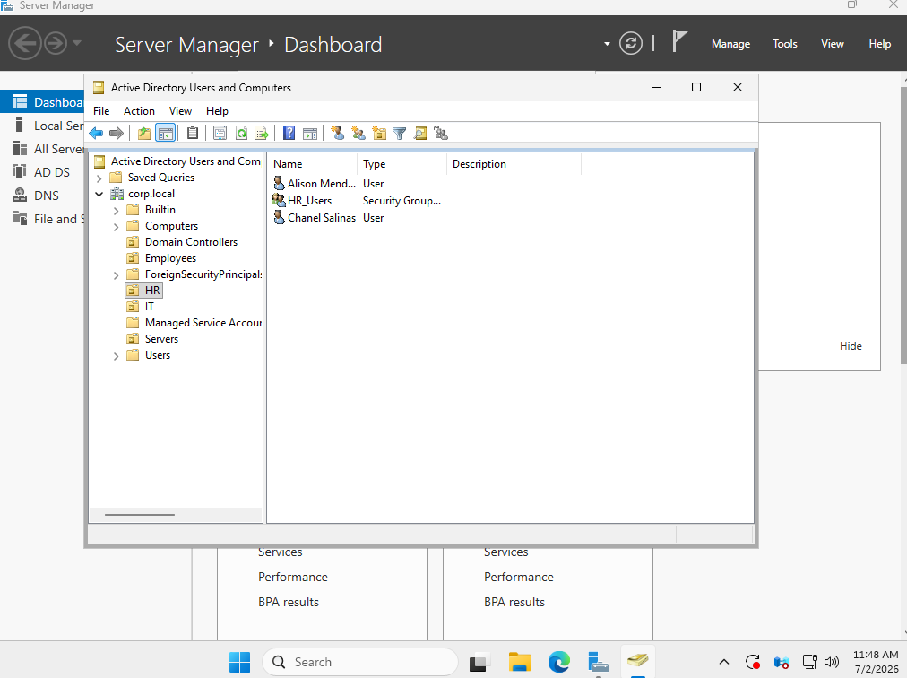
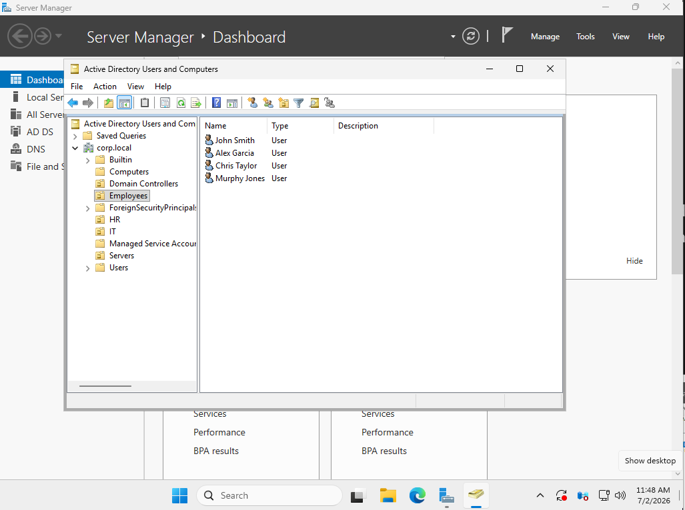
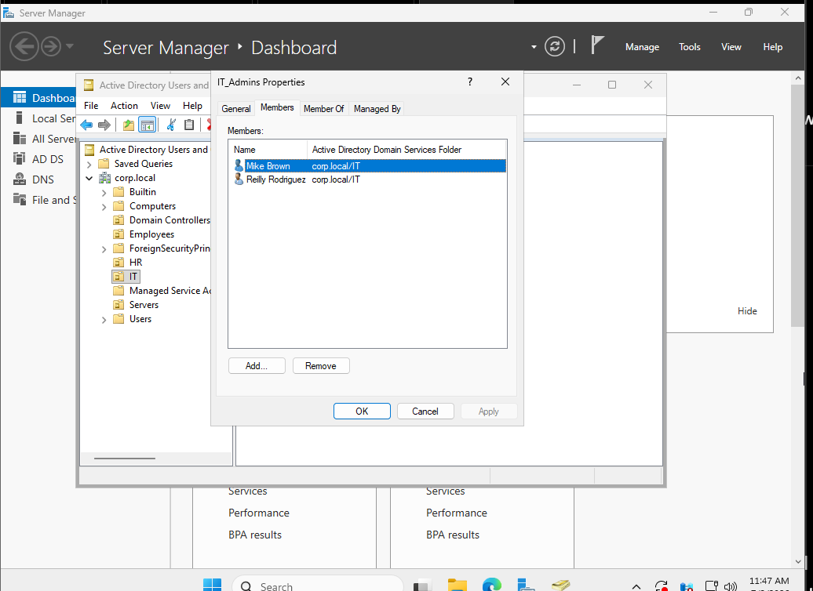
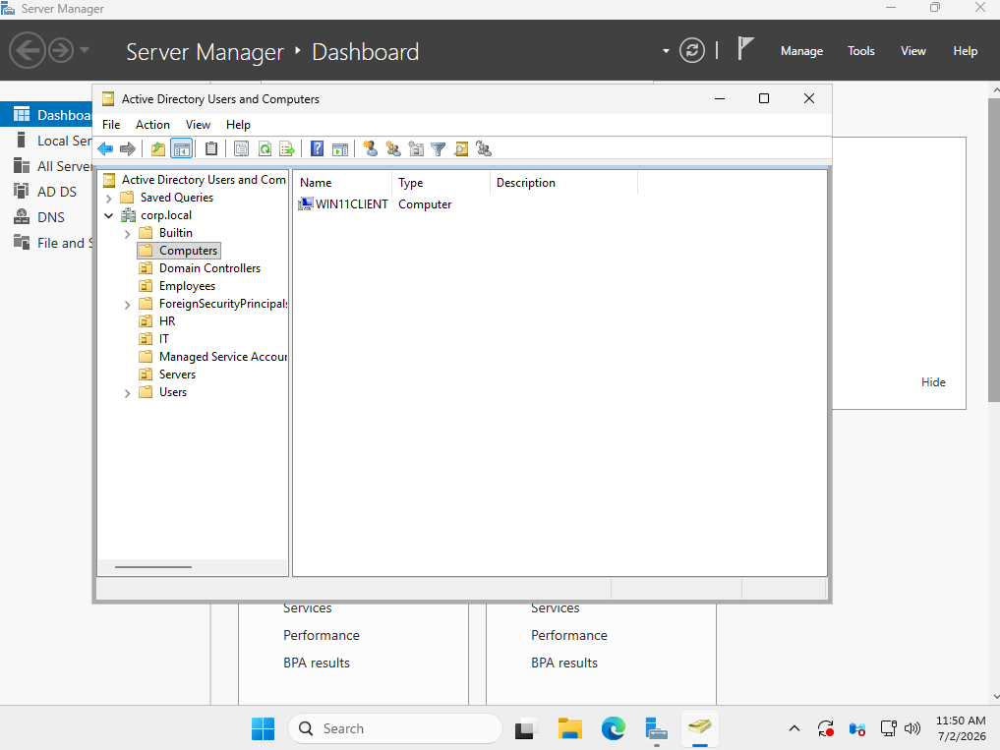
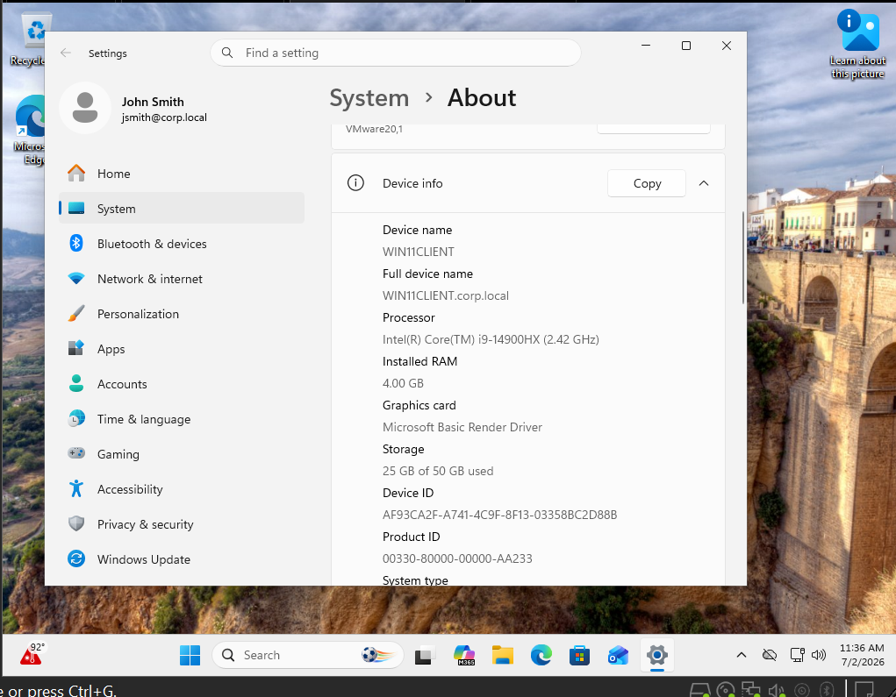

# Active Directory Home Lab

## Overview

I built this home lab to get hands-on experience with Active Directory and Windows Server. Instead of only learning the concepts, I wanted to understand how a company manages users, computers, and permissions in a real Windows domain.

Using VMware, I installed Windows Server 2025, promoted it to a Domain Controller, created a new Active Directory domain, organized users into departments, created security groups, and joined a Windows 11 workstation to the domain.

---

## Technologies Used

- Windows Server 2025
- Windows 11 Pro
- VMware Workstation Pro
- Active Directory Domain Services (AD DS)
- DNS

---

## What I Built

- Installed and configured a Windows Server 2025 Domain Controller
- Created the `corp.local` Active Directory domain
- Organized users into IT, HR, and Employees Organizational Units (OUs)
- Created domain user accounts for multiple departments
- Created security groups to organize user permissions
- Joined a Windows 11 client to the domain
- Verified domain authentication by logging into the Windows 11 client with a domain account

---

## Lab Environment

| Component | Name |
|----------|------|
| Domain | corp.local |
| Domain Controller | DC01 |
| Client Workstation | WIN11CLIENT |
| Virtualization Platform | VMware Workstation Pro |

---

## Active Directory Structure

```text
corp.local
│
├── IT
│   ├── Mike Brown
│   ├── Reilly Rodriguez
│   └── IT_Admins
│
├── HR
│   ├── Alison Mendoza
│   ├── Chanel Salinas
│   └── HR_Users
│
├── Employees
│   ├── John Smith
│   ├── Alex Garcia
│   ├── Chris Taylor
│   └── Murphy Jones
│
└── Computers
    └── WIN11CLIENT
```

---

## Project Screenshots

### Server Manager

Windows Server after installing Active Directory Domain Services and DNS.



---

### Active Directory Overview

Overview of the Active Directory domain and organizational structure.



---

### IT Organizational Unit

IT department users and the IT_Admins security group.



---

### HR Organizational Unit

HR department users and the HR_Users security group.



---

### Employees Organizational Unit

General employee accounts used throughout the lab.



---

### IT_Admins Security Group

Members assigned to the IT_Admins security group.



---

### Domain-Joined Computer

The Windows 11 client successfully joined to the Active Directory domain.



---

### Windows 11 Client

Windows 11 workstation logged into the domain with a domain user account.



---

## Skills Demonstrated

- Active Directory administration
- Windows Server administration
- User and group management
- Organizational Unit (OU) management
- Security group administration
- DNS configuration
- Windows domain joining
- VMware virtualization

---

## Key Takeaways

Building this lab gave me a much better understanding of how Active Directory works in a business environment. I learned how Domain Controllers manage authentication, why Organizational Units help organize departments, how security groups simplify permission management, and how Windows workstations authenticate against a domain. Completing the project also gave me hands-on experience with common IT administration tasks that are used in many Windows-based environments.
